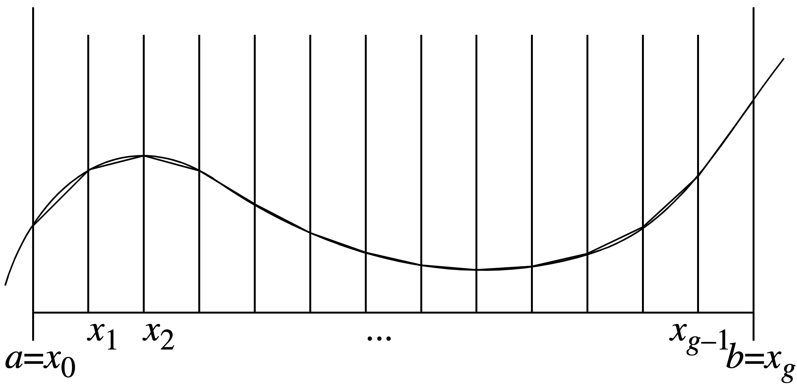

Data-Parallel C++ with oneAPI/SYCL
===================================

A growing challenge for the HPC community has been `performance portability <https://performanceportability.org>`_ , i.e., the ability to maintain consistent application performance in the context of increasing complexity and heterogeneity of hardware, as well as the additional need to maintain developer productivity and computational precision.
The intersection of performance, portability, and productivity goals (P3) has also been the focus of an annual workshop at the Supercomputing Conference (SC) for several years.

One of the key frameworks to emerge in response to the P3 challenge is oneAPI, which promises to be a single application programming interface (API) that can be used to program all available architectures.
Programming is done using a modern dialect of C/C++, known as Data-Parallel C++ and SYCL, a standard for higher-level abstractions for parallelism and concurrency.
While oneAPI is not the only alternative, the ability to write largely device-independent programs is a promising direction with great potential to exploit parallelism as the world moves toward more “on chip” heterogeneity and clusters thereof.

Running Example: Trapezoidal Integration
----------------------------------------

Sometimes, a program needs to integrate a function (i.e., calculate the area under a curve).
We might be able to use a formula for the integral, but this isn’t always possible.
An easy alternative approach, suitable for numeric integration, is to approximate the curve with straight line segments and calculate an estimate of the area from them.

 
Concretely, to find the area under the curve from a to b, we approximate the function by dividing the domain from a to b into g equally sized segments.
Each segment is (b – a) / g long. Let the boundaries of these segments be x0 = a, x1, x2, ... , xg = b.
The polyline approximating the curve will have coordinates (x0, f(x0)), (x1, f(x1)), (x2, f(x2)), ..., (xg, f(xg)).
This allows us to approximate the area under the curve as the sum of g trapezoids.

For the interested reader, you can see the code to produce this figure using Python's remarkable matplotlib package!

.. literalinclude:: ../scripts/plot-trapezoidal.py
   :language: python

Data-Parallel C++ Implementation
--------------------------------

Our `trapezoidal integration exemplar <https://github.com/LoyolaChicagoCode/unoapi-dpcpp-examples/tree/main/integration>`_ example demonstrates various key aspects of data-parallel C++ programming using Intel’s `oneAPI platform <https://www.intel.com/content/www/us/en/developer/tools/oneapi/overview.html>`_, which is based on the `SYCL <https://www.khronos.org/sycl>`_ cross-platform standard for heterogeneous accelerator-based computing.
Although the example is embarrassingly parallel, it nevertheless exhibits various non-trivial challenges that we will discuss in detail.

The exemplar’s sequential version illustrates the underlying fused-loop map-reduce algorithm, which maps each adjacent pair of function values to a trapezoid area and, in the same loop body, reduces (adds) the area to the cumulative result.

.. literalinclude:: ../snippets/snip-UnoAPI-main-sequential-option.tex
  :language: cpp
  :linenos: 
  :lineno-start: 65
  :lines: 3-15

We’ll see shortly how to write the data-parallel version of this algorithm in DPC++.

The Platform: Intel oneAPI/Khronos SYCL
---------------------------------------

The `SYCL standard <https://www.khronos.org/sycl>`_ defines high-level abstractions for parallel computing using modern C++, in an effort by Khronos to influence the ISO C standard to support heterogeneous computing.
`Data-Parallel C++ (DPC++) <https://spec.oneapi.io/versions/1.1-rev-1/elements/dpcpp/source/index.html>`_, a part of Intel’s oneAPI standard, is an implementation of SYCL.
Intel provides remote access to various types of accelerator hardware, including GPUs and FPGAs, through its `DevCloud program <https://www.intel.com/content/www/us/en/developer/tools/Dev\-Cloud/overview.html>`_.

Device Selection and Task Queues
^^^^^^^^^^^^^^^^^^^^^^^^^^^^^^^^

A typical DPC++ program starts with the selection of one or more accelerator devices based on criteria of varying specificity.
In our exemplar, the user can choose between running the code on the host CPU and an available accelerator:

.. literalinclude:: ../snippets/snip-UnoAPI-main-parallel-devices.tex
  :language: cpp
  :linenos: 
  :lineno-start: 99
  :lines: 3-5

The interface between the programmer and the chosen device is a *queue*, to which we can later submit *commands* for execution on the device.

.. literalinclude:: ../snippets/snip-UnoAPI-main-parallel-inorder-q.tex
  :language: cpp
  :linenos: 
  :lineno-start: 110
  :lines: 3-9

If we do not explicitly specify a device when creating our queue, the queue will automatically select the most suitable available device on the current hardware.
Also, we can choose between a simple in-order queue, as we have done here, or we can have the queue figure out the best order for executing the submitted commands without deadlocking.

In addition to programmatic device selection through the API, setting the ``ONEAPI_DEVICE_SELECTOR`` environment variable may be required to help oneAPI find specific accelerators; 
the section :ref:`running_on_nvidia` shows an example of this mechanism.

Buffers Shared Between Host and Device
^^^^^^^^^^^^^^^^^^^^^^^^^^^^^^^^^^^^^^

Data-parallel computing typically involves some form of data sharing between the host and the device.
SYCL allows several choices for this with varying degrees of control where the data should reside and how it is shared between host and device.
E.g., we could allocate a standard vector on the host and use universal shared memory (USM) to share it with the device executing the data-parallel instructions.
This might require copying substantial amounts of data between host and device and thereby impair performance.

Instead, a *buffer* is a higher-level data container that allows SYCL to determine where best to allocate the corresponding memory; a *range* represents a 1, 2, or 3-dimensional index range for a buffer.
By not explicitly backing a buffer by a host-allocated standard vector, the data can remain on the device for faster access during kernel execution—until we may need to access it on the host later.

.. literalinclude:: ../snippets/snip-UnoAPI-main-parallel-buffers.tex
  :language: cpp
  :linenos: 
  :lineno-start: 92
  :lines: 3-4

parallel_for() Construct
^^^^^^^^^^^^^^^^^^^^^^^^

At the heart of SYCL’s support for data parallelism lies the ``parallel_for()`` construct, which allows us to express the instructions that should execute in parallel.
While also providing varying degrees of control over splitting up the workload and assigning it to the accelerator device, SYCL is able to come up with a suitable assignment that maximizes parallelism based on the capabilities of the device.

.. literalinclude:: ../snippets/snip-UnoAPI-main-parallel-submit-parallel-for.tex
  :language: cpp
  :linenos: 
  :lineno-start: 116
  :lines: 3-8

In this example, ``f()`` represents the computation we perform in parallel on each data item.
As shown below, separating ``f`` into its own compilation unit enables us to unit-test it, as well as choose a specific implementation of ``f`` at build time.

To combine the trapezoids' areas into a single result, while allowing SYCL to maximize parallelism, we can use ``parallel_for()`` along with a suitable reduction operation, i.e., ``sycl::plus<>()``.

.. literalinclude:: ../snippets/snip-UnoAPI-main-parallel-submit-reduce.tex
  :language: cpp
  :linenos: 
  :lineno-start: 126
  :lines: 3-15

Separate Compilation and External Functions
^^^^^^^^^^^^^^^^^^^^^^^^^^^^^^^^^^^^^^^^^^^

Separate compilation of source files helps us decompose a software system into smaller modules.
This has multiple benefits, including separation of concerns, unit testing, easier collaborative development, and the ability to defer certain decisions (e.g., what we’re integrating) until build time.

In our exemplar, we’ll want to unit-test the function to be integrated and defer choosing a specific implementation of that function until build time.
To be able to separately compile the function and call it inside a DPC++ kernel, we declare it in this SYCL-specific way:

.. literalinclude:: ../snippets/snip-UnoAPI-sycl-external-interface.tex
  :language: c
  :linenos: 
  :lineno-start: 6
  :lines: 3-5

To observe a speedup when using ``parallel_for``, we define ``f`` as an intentionally inefficient way to compute the unit value:

.. literalinclude:: ../snippets/snip-UnoAPI-f-implementation.tex
  :language: cpp
  :linenos: 
  :lineno-start: 4
  :lines: 3-5

Another Example: Calulating Pi using the Monte Carlo Method
-----------------------------------------------------------

This example follows a similar pattern as the trapezoidal integration one.
Conceptually, each player throws a given number of darts, where those that fall within the quarter circle are counted toward the calculation of π.
The various players operates in parallel with and independently of all other players
To improve randomization, each player's random number generator instance starts with a differen seed offset.

.. code-block:: cpp

  q.submit([&](auto &h) {
      const auto c = c_buf.get_access<sycl::access_mode::write>(h);

      h.parallel_for(number_of_players, [=](const auto index) {
          const auto offset = 37 * index.get_linear_id() + 13;
          oneapi::dpl::minstd_rand minstd(seed, offset);
          oneapi::dpl::ranlux48 ranlux(seed, offset);

          constexpr uint64_t R{3037000493UL}; // largest prime <= sqrt(ULONG_MAX / 2)
          oneapi::dpl::uniform_int_distribution<uint64_t> distr(0, R);
          const auto r_square{R * R};

          auto darts_within_circle{0UL};
          for (auto i{0UL}; i < number_of_darts; i++) {
              const auto x{use_ranlux ? distr(ranlux) : distr(minstd)};
              const auto y{use_ranlux ? distr(ranlux) : distr(minstd)};
              const auto d_square{x * x + y * y};
              if (d_square <= r_square)
                  darts_within_circle++;
          }
          c[index] = darts_within_circle;
      });
  });

After all the players are done, we perform a reduction to combine the number of darts within the quarter circle.

.. code-block:: cpp

  q.submit([&](auto &h) {
      const auto c{c_buf.get_access<sycl::access_mode::read>(h)};
      const auto sum_reduction{sycl::reduction(s_buf, h, sycl::plus<>())};

      h.parallel_for(
        sycl::range<1>{number_of_players}, 
        sum_reduction, 
        [=](const auto index, auto &sum) {
          sum.combine(c[index]);
      });
  });

A sample run looks like this:

.. code-block:: text
  
  [2023-10-09 20:12:49.704] [info] 4 players are going to throw 1000000 darts each
  [2023-10-09 20:12:49.704] [info] using minstd engine with real distribution
  [2023-10-09 20:12:49.704] [info] randomization is off
  [2023-10-09 20:12:49.763] [info] Device: Intel(R) Core(TM) i5-1030NG7 CPU @ 1.10GHz
  [2023-10-09 20:12:49.763] [info] Max workgroup size: 8192
  [2023-10-09 20:12:50.474] [info] done submitting to queue...waiting for results
  [2023-10-09 20:12:50.474] [info] result[0] = 786512
  [2023-10-09 20:12:50.474] [info] result[1] = 786064
  [2023-10-09 20:12:50.474] [info] result[2] = 786509
  [2023-10-09 20:12:50.474] [info] result[3] = 786054
  [2023-10-09 20:12:50.474] [info] sum = 3145139
  pi = 3.145139
