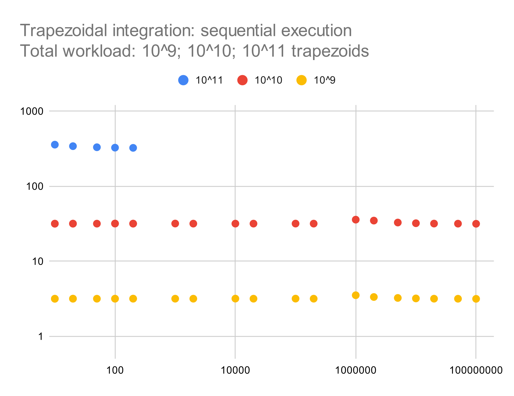
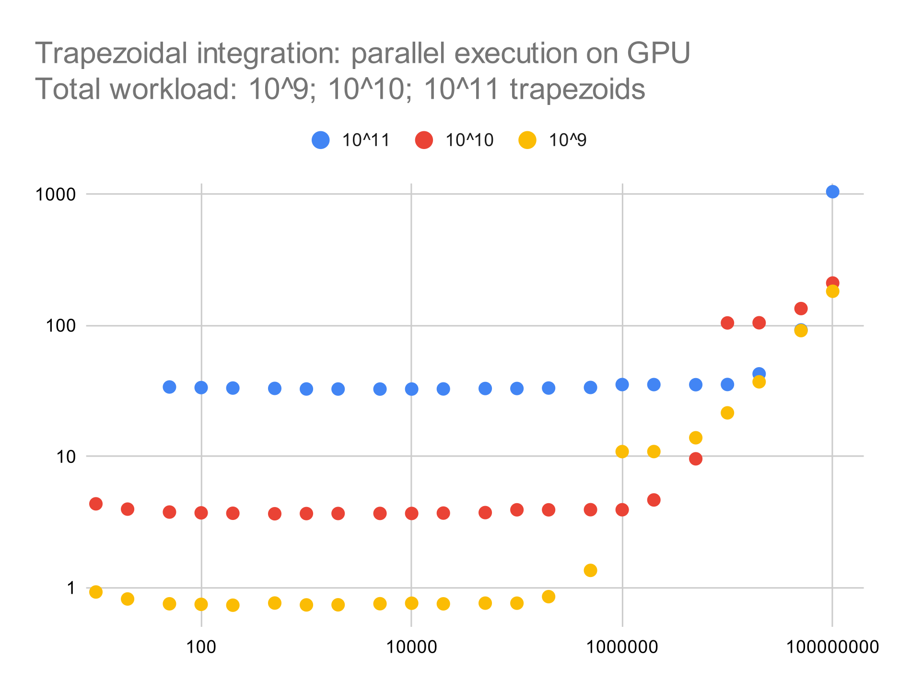

Performance Essentials
========================

In this section, we discuss various aspects of performance of data-parallel C++ code, including how we can measure time performance in terms of elapsed "wall clock" time, and how we can achieve and observe a speedup when leveraging data parallelism.

Measuring time performance
--------------------------

We can use the ``chrono`` section of the C++ Standard Library for measuring performance at various points during program execution.

.. code-block:: cpp

   void mark_time(
     ts_vector & timestamps,
     const std::string_view label)
   {
     timestamps.push_back(std::pair(label.data(),
       std::chrono::steady_clock::now()));
   }

.. todo:: use code snippet instead

Every time we want to add a timestamp, we invoke ``mark_time`` with a suitable string label for each phase whose performance we are measuring:

- memory allocation
- queue creation
- core computation (e.g., integration)
- remainder of execution (e.g., displaying the results)
- total wall clock execution time

At the end, we use the ``print_timestamps`` function to print the collected measurements in comma-separated-values (CSV) format, as shown in the sample runs below.

How to achieve speedup
----------------------

As discussed in the previous chapter, at the core of data parallelism lies the ability to perform many operations on similar data in parallel at the hardware level.
Beyond Amdah's law, there is a tradeoff between the speedup gained through parallelization and the additional overhead of shipping data back and forth between the host computer and the accelerator.
To understand this tradeoff, we are separately measuring the various phases of program execution as shown above.

For the following experiments, we are going use the following integrand (function to be integrated):

.. code-block:: cpp
		
   double f(const double x) {
       return 3 * pow(x, 2);
   }

.. todo:: use code snippet instead

In addition, we have factored out the following function to compute (sequentially) a single outer trapezoid from as many inner trapezoids as the grain size, which we can specify as a command-line argument.
We invoke this common function from both the outer sequential loop and the outer vectorized ``parallel_for`` construct.

.. code-block:: cpp

   double compute_outer_trapezoid(
      const int grain_size,
      const double x_pos,
      const double dx_inner,
      const double half_dx_inner
   ) {
      auto area{0.0};
      auto y_left{f(x_pos)};
      for (auto j{0UL}; j < grain_size; j++) {
         auto y_right{f(x_pos + (j + 1) * dx_inner)};
         area += trapezoid(y_left, y_right, half_dx_inner);
         y_left = y_right;
      }
      return area;
   }
  
.. todo:: use code snippet instead

In this way, the actual effort becomes significantly greater than the overhead from setup, so we are likely to observe a greater benefit from parallelization.

We will now compare wall clock execution times on our academic department's compute server with the following characteristics:

- dual AMD EPYC 9354 32-Core processors
- six NVIDIA RTX A6000 GPUs (though we will be using only one at a time for now)

Sequential execution
^^^^^^^^^^^^^^^^^^^^

We start with strictly sequential execution on the node's CPU using the `-s` option of our integration example.

.. code-block:: text

   > ./build/bin/integration -n 100000000000 -g 100 -s
   [2023-12-02 09:53:18.563] [info] integrating function from 0 to 1 using 100000000000 trapezoid(s) with grain size 100, dx = 1e-09
   [2023-12-02 09:53:20.463] [info] starting sequential integration
   [2023-12-02 09:58:46.057] [info] result should be available now
   result = 1.0000000000000597
   [2023-12-02 09:58:46.202] [info] all done for now
   TIME,DELTA,UNIT,DEVICE,PHASE
   68410926133405,0,ns,sequential,Start
   68412826265635,1900132230,ns,sequential,Memory allocation
   68738419748223,325593482588,ns,sequential,Integration
   68738565342993,145594770,ns,sequential,DONE
   68738565342993,327639209588,ns,sequential,TOTAL
		
The total wall time for this sequential run was about 328 seconds.

Parallel execution on an accelerator
^^^^^^^^^^^^^^^^^^^^^^^^^^^^^^^^^^^^

Next, we allow our integration code to select and utilize the available accelerator.

.. code-block:: text

   > ./build-nvidia/bin/integration -n 100000000000 -g 100
   [2023-12-02 00:42:30.267] [info] integrating function from 0 to 1 using 100000000000 trapezoid(s) with grain size 100, dx = 1e-09
   [2023-12-02 00:42:30.267] [info] preparing for vectorized integration
   [2023-12-02 00:42:30.832] [info] Device: NVIDIA RTX A6000
   [2023-12-02 00:42:30.837] [info] done submitting to queue...waiting for results
   [2023-12-02 00:43:03.964] [info] result should be available now
   result = 1.0000000000000002
   [2023-12-02 00:43:03.971] [info] all done for now
   TIME,DELTA,UNIT,DEVICE,PHASE
   35362630446292,0,ns,NVIDIA RTX A6000,Start
   35362630466323,20031,ns,NVIDIA RTX A6000,Memory allocation
   35363195459619,564993296,ns,NVIDIA RTX A6000,Queue creation
   35396327471267,33132011648,ns,NVIDIA RTX A6000,Integration
   35396333911606,6440339,ns,NVIDIA RTX A6000,DONE
   35396333911606,33703465314,ns,NVIDIA RTX A6000,TOTAL
		
The total wall time for this run was about 33.7 seconds, including the overhead for preparing the task queue and shipping any required data back and forth.
This corresponds to a speedup of about 10 compared to sequential execution.

These measurements lead to various insights on what is going “under the hood” during program execution, to name a few:

- Initial allocation of a SYCL buffer takes very little time compared to allocating a standard vector.
- Queue creation introduces a certain overhead, comparable to allocation a vector on the host CPU.

Parallel execution on a multicore CPU
^^^^^^^^^^^^^^^^^^^^^^^^^^^^^^^^^^^^^

Our examples also support a `-c` option for executing data-parallel code on the host CPU itself.
This is reasonable when the CPU already has multiple cores.

.. code-block:: text

   > ./build/bin/integration -n 100000000000 -g 100 -c
   [2023-12-03 22:34:05.010] [info] integrating function from 0 to 1 using 100000000000 trapezoid(s) with grain size 100, dx = 1e-09
   [2023-12-03 22:34:05.010] [info] preparing for vectorized integration
   [2023-12-03 22:34:05.582] [info] Device: AMD EPYC 9354 32-Core Processor
   [2023-12-03 22:34:05.803] [info] done submitting to queue...waiting for results
   [2023-12-03 22:34:06.578] [info] result should be available now
   result = 1.0000000000000009
   [2023-12-03 22:34:06.967] [info] all done for now
   TIME,DELTA,UNIT,DEVICE,PHASE
   200457373084707,0,ns,AMD EPYC 9354 32-Core Processor,Start
   200457373102067,17360,ns,AMD EPYC 9354 32-Core Processor,Memory allocation
   200457945058810,571956743,ns,AMD EPYC 9354 32-Core Processor,Queue creation
   200458940879950,995821140,ns,AMD EPYC 9354 32-Core Processor,Integration
   200459329758480,388878530,ns,AMD EPYC 9354 32-Core Processor,DONE
   200459329758480,1956673773,ns,AMD EPYC 9354 32-Core Processor,TOTAL

The total wall time for this run was about 1.96 seconds, including the overhead for preparing the task queue on the host CPU.
This corresponds to a speedup of about 165 compared to sequential execution or a speedup of about 17 compared to execution on the GPU, possibly because of the better support for 64-bit floating point arithmetic on the CPU.

Observed scaling
----------------

In this section, we'll share our high-level observations of scaling in terms of the total workload (number of trapezoids) n and the grain size (number of inner, always sequential trapezoids) g, for our three execution modes:

- sequential execution
- parallel execution on a single NVIDIA RTX A6000 GPU
- parallel execution on dual AMD EPYC 9354 32-Core processors

Each chart shows a scatter plot with several color-coded series corresponding to total workload.
The x-axis shows grain size, and the y-axis shows wall time in seconds.
Axis ranges and series colors are consistent across charts, thereby allowing a direct comparison of measurements for a given workload and grain size.

As expected, for sequential execution, wall time is proportional to total workload and independent of grain size.
(We discontinued the experiment for the highest workload only to save some time.)

For parallel execution on the GPU, we are achieving a speedup of about 10 (one full order of magnitude).
Otherwise, wall time is still proportional to total workload and mostly independent of grain size; excessive grain size, however, appears to overload GPU cores and can even result in a slowdown relative to sequential execution.
In this and the next chart, the missing data points for smaller grain sizes are caused by the resulting range of the ``parallel_for`` becoming larger than ``INT_MAX``.

.. figure:: ../images/walltime-cpu.png

For parallel execution on the CPU, we are achieving of almost three orders of magnitude relative to sequential execution, and almost two orders of magnitude relative to parallel execution on the GPU.
Otherwise, wall time proportional (slightly sublinear) to total workload and mostly independent of grain size, except for a certain overhead for small grain sizes that put an insufficient load on each processor core.

In addition, our raw performance data are `available in this spreadsheet <https://docs.google.com/spreadsheets/d/1NUD_yqfwgUr9XYucRgMykKDrgUAETmvC4mzOMVDxDZY>`_.

.. TODO chapter conclusion
